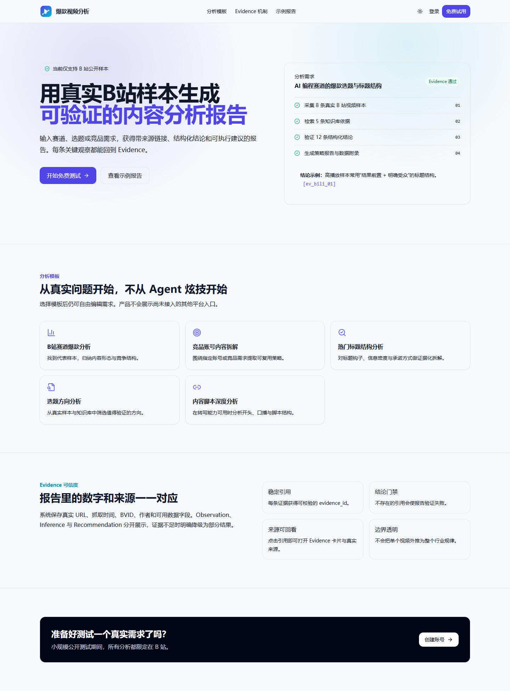
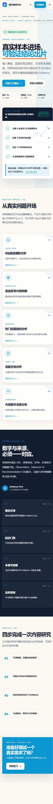
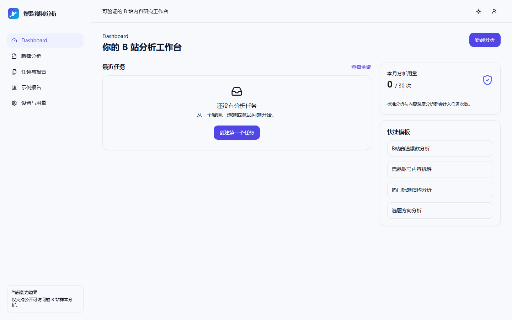
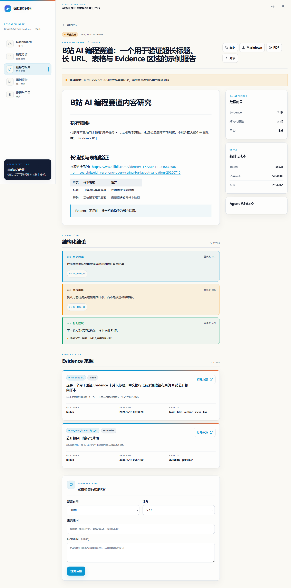

# 爆款视频分析

面向小规模公开测试的 B 站单平台内容分析产品：输入赛道、选题或竞品需求，生成带真实视频样本、来源链接、结构化结论和可执行建议的报告。

> 当前真实视频搜索仅支持 B 站。项目不会宣称支持抖音、快手或小红书实时分析。

## 核心 Agent 工作流

这个项目首先是一个 LangGraph 多 Agent 系统，Next.js、FastAPI、Arq 和 PostgreSQL 是让它可排队、可恢复、可追踪地运行的产品支撑。`Worker` 只是承载整张状态图的后台进程，不是用来替代 Researcher、Analyst 或 Writer 的单一 Agent。

```text
用户请求
  │
  ▼
Entry：意图 / 平台 / 能力预检（分析主路径为确定性判断）
  │
  ▼
Planner：拆成最多 3 个研究任务
  │
  ▼
Research Loop / Researcher：LLM 选择工具与参数
  ├─ search_videos ─────────────→ Bilibili 公开数据
  ├─ rag_search ────────────────→ ChromaDB 知识库
  ├─ get_transcript（深度模式）─→ MiMo ASR
  └─ 动态能力注册 + Pydantic 参数校验 + MCP 调用/回退
  │  累积结构化 Evidence
  ▼
Evidence Gate：无真实证据则 partial/终止
  │
  ▼
Analyst：基于 Evidence 生成 observation / inference / recommendation
  │  最多 2 轮，输出带 evidence_ids 的结构化 claims
  ▼
Writer：只组织已有 claims 与 Evidence，单次生成报告，不新增事实
  │
  ▼
引用校验 + 确定性附录 + 报告持久化
```

v2 的重点不是“角色数量”，而是把语义决策留给 Planner、Researcher、Analyst、Writer，把平台边界、循环上限、Evidence 门禁和发布校验交给代码。v1 的 Supervisor 集中路由回环仍保留用于同任务 A/B 与回退，但不参与默认正常链路。

## 前端体验

前端采用“成熟动漫编辑部 / 科技内容研究工作台”的视觉方向：公共页面使用更鲜明的编辑网格、分镜与 Evidence 节点语言，工作台和报告页保持克制，以长报告、结构化结论和来源证据的可读性为优先。浅色与深色主题共用语义 Token，支持桌面、平板、手机、键盘操作、减少动态效果和浏览器打印/PDF。



<details>
<summary>移动端首页、用户 Dashboard 与报告详情</summary>






</details>

设计决策见 [前端设计说明](docs/frontend-design.md)，本轮真实浏览器与构建检查见 [2026-07-15 前端验收记录](docs/frontend-validation-20260715.md)。

## 产品能力

- 注册、登录、退出与 HttpOnly Cookie 会话；密码使用 Argon2 哈希
- PostgreSQL 长期保存用户、任务、报告、Evidence、反馈、用量和分享链接
- Arq + Redis 执行 2–5 分钟后台分析任务，支持幂等、取消、有限重试、超时和轮询进度
- LangGraph v2 保持默认主链路：Entry → Planner → Research Loop → Evidence Gate → Analyst → Writer
- v1 Supervisor 回环保留为 A/B 与回退，不作为产品默认流程
- 每条 Evidence 获得稳定 `evidence_id`；Observation 必须引用真实 Evidence
- 报告数据附录由程序确定性生成，不完全交给 LLM
- 高熵只读分享链接支持过期与撤销；公开页不暴露用户、成本和内部执行轨迹
- Markdown 导出、浏览器打印/PDF、反馈与用量记录
- MiMo ASR 内容深度分析：独立 OpenAI 兼容客户端，讯飞保留为可选回退
- 桌面、平板、手机与深浅主题响应式界面

## 产品运行与持久化架构

```text
Next.js UI
  │ HttpOnly Cookie / polling
  ▼
FastAPI ─────────────── PostgreSQL 16
  │ create/enqueue        users/jobs/reports/evidence/feedback/usage/shares
  ▼
Arq + Redis
  │ queue/status/events/cache/locks
  ▼
Worker
  └─ 执行上方完整 LangGraph v2 Agent 工作流
```

工具调用由图内 Research Loop 发起，经 MCP Server 访问 Bilibili、ChromaDB 与可选 ASR。PostgreSQL 保存长期业务事实；Redis 只承担队列、临时状态、事件、锁和缓存。

Compose 包含 8 个服务：`frontend`、`app`、`worker`、`postgres`、`redis`、`chromadb`、`mcp-server`、`nginx`。PostgreSQL、Redis 和 ChromaDB 均使用 Docker 命名卷，不把数据库内部文件写入仓库。

详细说明：

- [产品架构与任务流](docs/product-mvp.md)
- [LangGraph v2 Agent 架构与 A/B](docs/architecture-v2-plan.md)
- [P0-B Search Provider 与搜索快照](docs/content-intelligence-search-providers.md)
- [2026-07-16 P0-B 验证记录](docs/content-intelligence-p0b-validation-20260716.md)
- [P0-C Creator Provider、竞品相关性与 Top 5](docs/content-intelligence-competitor-scoring.md)
- [2026-07-16 P0-C 验证记录](docs/content-intelligence-p0c-validation-20260716.md)
- [2026-07-16 P0-C Creator Provider Recovery](docs/content-intelligence-p0c-recovery-20260716.md)
- [权限、数据与 Evidence 边界](docs/security-and-data.md)
- [2026-07-13 验收记录](docs/validation-20260713.md)

## 快速开始

```powershell
git clone https://github.com/wow-wogua/viral-video-agent.git
cd viral-video-agent
Copy-Item .env.example .env

# 编辑 .env：至少配置通用 LLM Key、POSTGRES_PASSWORD 和 JWT_SECRET
docker compose up -d --build

# 查看状态
docker compose ps
docker compose logs -f app worker
```

访问：

- 产品：<http://localhost:3000>
- API 文档：<http://localhost:8000/docs>
- 经 Nginx：<http://localhost>

数据库迁移由 `app` 启动命令自动执行，也可以手动运行：

```powershell
docker compose run --rm app alembic upgrade head
```

## 环境变量

生产环境必须更换：

```dotenv
APP_ENV=production
POSTGRES_PASSWORD=replace-with-a-strong-password
JWT_SECRET=replace-with-at-least-32-random-bytes
```

产品 Worker 默认使用允许应用后端调用的 DeepSeek API：

```dotenv
DEFAULT_LLM_PROVIDER=deepseek
DEEPSEEK_API_KEY=
DEEPSEEK_BASE_URL=https://api.deepseek.com
DEEPSEEK_MODEL_ID=deepseek-v4-pro
```

如需把 Agent LLM 切换为余额扣费 MiMo 公共 OpenAI 兼容接口：

```dotenv
DEFAULT_LLM_PROVIDER=mimo
MIMO_API_KEY=
MIMO_OPENAI_BASE_URL=https://api.xiaomimimo.com/v1
MIMO_CHAT_MODEL_ID=mimo-v2.5-pro
```

MiMo ASR 使用独立客户端和同一公共 OpenAI 兼容地址：

```dotenv
MIMO_API_KEY=
MIMO_ASR_BASE_URL=https://api.xiaomimimo.com/v1
MIMO_ASR_MODEL=mimo-v2.5-asr
MIMO_ASR_LANGUAGE=zh
TRANSCRIPT_PROVIDER=mimo
ASR_MAX_VIDEOS=5
```

同一把余额扣费 Key 可以同时用于 MiMo Agent LLM 和 ASR，但 LLM 路由与转写仍使用独立客户端。MiMo Token Plan 另有 `https://token-plan-cn.xiaomimimo.com/v1` OpenAI 兼容地址并包含 ASR 模型，但其页面明确限制为兼容 AI 编程/智能体工具中的交互式使用，不可用于自动化脚本或应用后端，因此本项目 Worker 不使用 Token Plan Key。`ASR_MAX_VIDEOS` 只允许 1～5，默认 5；内容深度分析从本次返回样本中选择最多 N 个唯一的公开 B 站视频，不是全站质量 Top N。没有配置可用于应用后端的 ASR Key 时，前端禁用内容深度分析；转写失败时 Worker 降级为元数据分析，不编造视频内容。用户不需要上传音频，Worker 会自动提取公开视频音频。

## 后台任务 API

```text
POST   /jobs
GET    /jobs
GET    /jobs/{job_id}
POST   /jobs/{job_id}/cancel
POST   /jobs/{job_id}/retry
GET    /jobs/{job_id}/events
GET    /jobs/{job_id}/search-snapshot
GET    /jobs/{job_id}/competitors
GET    /reports/{report_id}
POST   /reports/{report_id}/shares
POST   /reports/{report_id}/feedback
```

状态：`pending`、`running`、`completed`、`partial`、`failed`、`cancelled`。

Redis 只保存队列、临时状态、事件和缓存；长期业务事实全部进入 PostgreSQL。

`task_mode=content_intelligence` 默认保持 P0-B 搜索快照入口：支持最多 5 页 Development/Import Provider、逐页状态、BVID/MID 去重和按 crawl run 冻结的视频/创作者观测；历史快照不从全局最新实体回读。显式传 `include_competitors=true` 时才继续执行 P0-C Creator Provider、结构化相关性、确定性评分和最多5个 qualified Top 5，并通过独立接口查询；它仍不生成代表视频、ASR、完整情报报告或正常 `reports` 行。未传 `task_mode` 的现有请求继续走旧分析路径。

## Evidence 引用

Analyst 输出：

```json
{
  "claim": "代表样本的标题普遍明确指出任务和结果",
  "claim_type": "observation",
  "evidence_ids": ["ev_12345678abcdef00"],
  "confidence": 0.86
}
```

- `observation` 没有 Evidence 会被拒绝
- 不存在的 `evidence_id` 会触发 `REPORT_VALIDATION_FAILED`
- Writer 只能使用已有 claim 与 Evidence
- 程序追加结构化结论索引和数据附录
- 报告明确说明样本边界，不把单个视频外推为行业规律

## ASR 与音频边界

Worker 镜像内置 `ffmpeg` 和 `yt-dlp`。内容深度分析只处理公开可访问且用户有权分析的 B 站内容：

- 从本次排行榜/热门池返回并经标题过滤的样本中选择最多 `ASR_MAX_VIDEOS` 个唯一视频，不代表 B 站全站搜索或质量 Top N
- 仅接受 B 站 HTTPS URL，不绕过登录、付费或访问控制
- 最长 600 秒，Base64 后最大 10MB
- 音频只在 `tmp/` 临时存在，任务后自动删除且禁止提交
- 按 BVID 与 `audio_hash` 缓存转写
- 自动测试全部使用 Mock，不调用真实收费 API

## 测试

```powershell
# Python
.\.venv\Scripts\python.exe -m pytest -q

# 前端
cd frontend
npm run lint
npm run build

# Compose
cd ..
docker compose config --quiet
```

当前完整 Python 回归为 158 条测试。P0-C 的工程链路和 Creator Provider Recovery 可靠性已实现，但 Recovery 低频 canary 仍出现 HTTP 412 与 Provider `-352`，没有重跑 20 关键词质量 Gate；原 Gate 仍未通过，不能进入 P0-D。详细结果见 [验证记录](docs/content-intelligence-p0c-validation-20260716.md)和 [Recovery 记录](docs/content-intelligence-p0c-recovery-20260716.md)。

### 真实 API 冒烟（2026-07-13）

- 标准分析通过一次真实产品链路：认证 → PostgreSQL job → Arq Worker → MiMo LLM → 25 条 Evidence → 报告与用量 → 分享。耗时 96.16 秒、6 次 LLM、输入/输出 22900/3238 token、无重试、`asr_seconds=0`。
- 该标准任务是单次本地端到端冒烟（n=1），不代表线上性能。报告引用校验通过，但暴露了 Analyst thinking-only 导致结构化 claims 为空的问题；现已关闭结构化节点 thinking、提高 Analyst/Writer 输出预算，并增加“有 Evidence 时 claims 不能为空”的发布门禁。
- 深度分析通过一次真实链路：DeepSeek Agent LLM + MiMo `mimo-v2.5-asr`。任务 `completed`，耗时约 104.24 秒，8 次 LLM，输入/输出 27982/6198 token，估算成本 `$0.005613`；自动提取并转写 329.676 秒公开 B 站音频，得到 1126 字符转写、5 条结构化 claims 和 1 条有效 Transcript Evidence。
- Redis 的 BVID 与 `audio_hash` 两个缓存键均写入，TTL 约 30 天；再次读取时将 Provider 与音频提取替换为必然失败实现，仍命中同一缓存，因此未发生第二次 ASR 调用。`/app/tmp` 无音频残留，PostgreSQL 与日志未发现原始音频、Base64 或 Key。
- 真实任务还暴露了两处收口问题：报告模型元数据仍记录旧的 MiMo 常量；另一次无效 `get_transcript` 工具调用的错误字符串被包装成 Transcript Evidence。现已按实际默认 Provider 写入模型元数据，并拒绝 MCP 错误结果和非结构化转写进入 Evidence。没有为这两处确定性修复重复提交收费任务。
- 两次任务都只是单次本地端到端冒烟（各 n=1），不代表线上性能、真实用户完成率或大规模 ASR 成功率；项目尚未部署。
- DeepSeek 官方模型列表已迁移为 `deepseek-v4-flash` / `deepseek-v4-pro`，旧 `deepseek-chat` 与 `deepseek-reasoner` 将于 2026-07-24 15:59 UTC 废弃。项目默认切到 `deepseek-v4-pro`，并通过 `extra_body.thinking.type=disabled` 显式关闭结构化节点的默认 thinking。
- 使用项目真实 `ChatOpenAI` 客户端做最小迁移冒烟：返回模型为 `deepseek-v4-pro`，正文非空且没有 `reasoning_content`，证明官方 thinking 开关已正确透传；这不是一次完整产品任务。
- 切换后再通过正常产品链路完成一次 V4 Pro 标准任务：69.16 秒、5 次 LLM、12993/3333 token、估算 `$0.008552`、5 条 claims、25 条 Evidence、无重试、`asr_seconds=0`。该结果仍是本地 n=1 冒烟。

## 研究评测边界

- RAG：40 篇、235 个标题感知 chunk；自建固定集 28/28 命中，不代表开放域泛化
- v2 架构 A/B：两组历史任务中 LLM 调用由 16→7、14→6，耗时由 164.8s→79.4s、179.6s→119.4s
- 微调模型仅为 Researcher 可选 A/B 路径。项目三 v4.1 已在冻结的自建窄域同集评测上超过 DeepSeek V4 Pro，并完成 3 条冻结任务的只读接入 A/B；它只是 Researcher 优先候选，未证明端到端产品质量、成本或延迟全面更优，因此项目默认仍使用 `deepseek-v4-pro`，不会自动切换
- BFCL、tau-bench 均为风格化自建评测，不是官方榜单

## Logo 与品牌

`frontend/public/logo-mark.svg`、`logo-wordmark.svg`、`favicon.svg` 和 `frontend/src/components/Logo.tsx` 均为本项目原创代码原生 SVG。图形由播放三角、趋势线和 Evidence 节点组成，不使用 B 站电视图标、粉色品牌元素或第三方商标素材。
