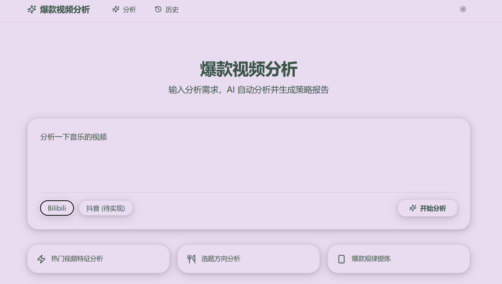
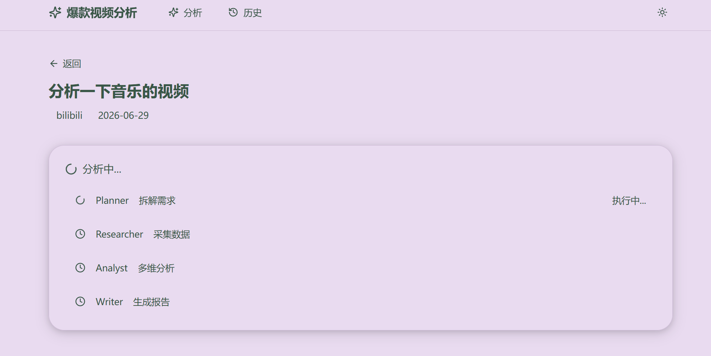
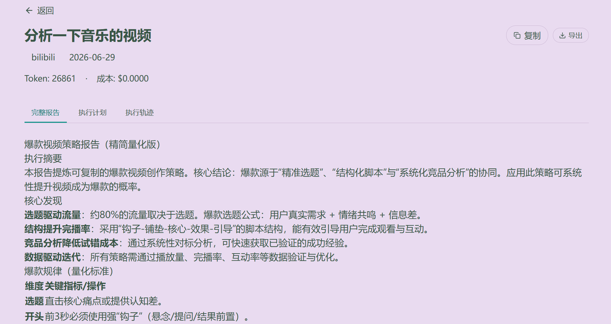
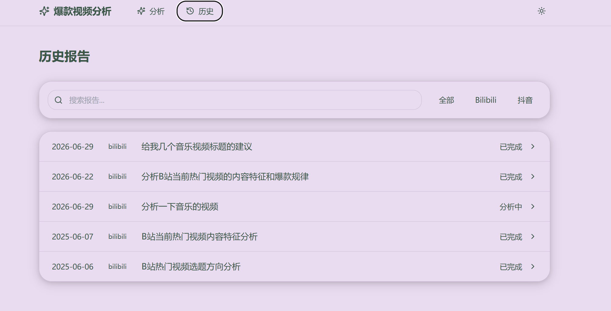
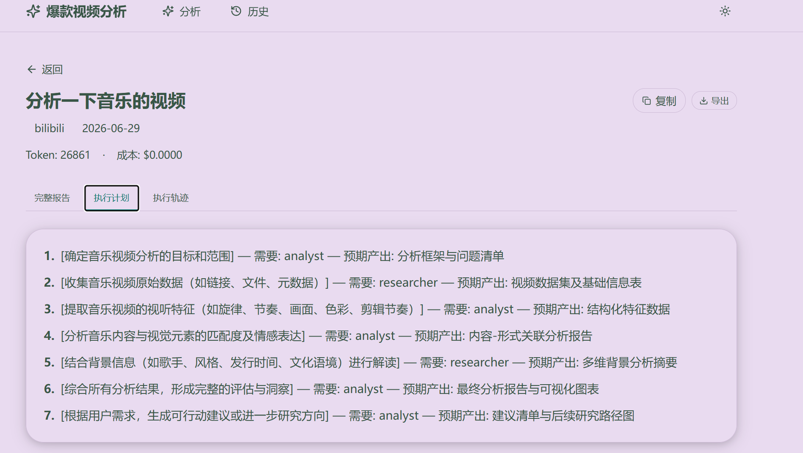
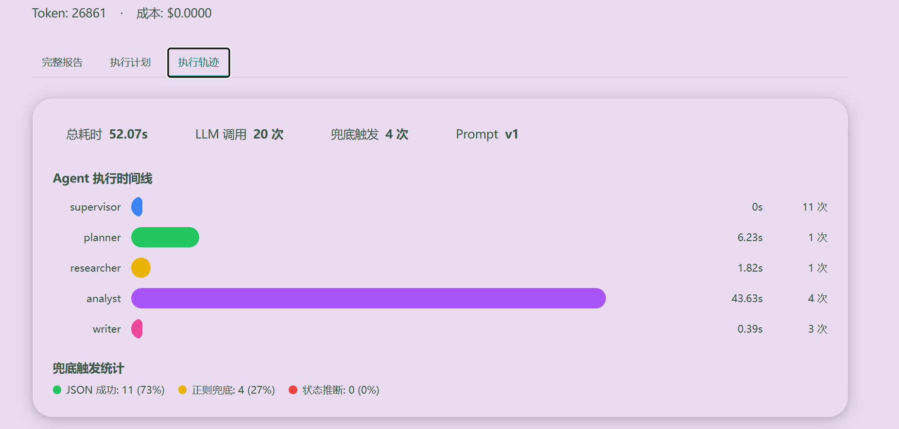

# 爆款视频分析多智能体系统

基于 LangGraph 的 5-Agent 串行回环系统，自动分析短视频平台爆款视频，提炼爆款规律并生成策略报告。

## 架构

```
用户输入 → Supervisor → Planner → Researcher → Analyst → Writer → 报告
              ↑            ↓          ↓            ↓         ↓
              └────────────┴──────────┴────────────┴─────────┘
                    所有节点回到 Supervisor（集中路由）
```

**核心设计：**
- Supervisor 集中路由 + 意图分类（非分析请求直接回答）+ 三层兜底解析（JSON→正则→状态推断）
- Researcher LLM 驱动选择 `search_videos` / `rag_search` / `get_transcript` / `get_trend_data` / `none`，通过 MCP 调用并保留直接函数兜底
- `raw_data` 与搜索关键词使用 reducer 跨多步累积；Planner → Researcher → Analyst → Writer 存在数据依赖，当前不是扇出并行架构
- Analyst 自评循环（默认置信度阈值 0.8，可用环境变量调整）+ Writer 修订循环；达到最大迭代时保留真实置信度
- 请求携带稳定 `user_id`，长期记忆按用户隔离；Redis 只保存缓存、历史记录和 running/completed/failed 状态，当前未接入 Celery
- CostTracker / TraceTracker / FallbackCounter 使用请求上下文隔离，避免并发请求串统计
- RAG 检索平台过滤（B站/抖音/快手自动识别）

## 演示

### 首页


### 分析中


### 报告页面


### 历史记录


### 执行轨迹



## 技术栈

| 组件 | 技术 |
|------|------|
| 编排框架 | LangGraph |
| LLM | MiMo / DeepSeek / 微调模型（Qwen3-4B LoRA） |
| 工具协议 | MCP (SSE) |
| 向量数据库 | ChromaDB |
| 后端 | FastAPI |
| 前端 | Next.js + Tailwind + Zustand |
| 缓存与状态 | Redis（缓存 / 历史记录 / 状态查询；无 Celery worker） |
| 反向代理 | Nginx |
| 容器化 | Docker Compose (6 服务) |

## 快速开始

```powershell
# 1. 克隆项目
git clone https://github.com/wow-wogua/viral-video-agent.git
cd viral-video-agent

# 2. 配置环境变量
cp .env.example .env
# 编辑 .env，填入你的 API Key

# 3. 启动服务
docker-compose up -d

# 4. 访问
# 前端页面：http://localhost
# 后端 API：http://localhost:8000
# MCP Server：http://localhost:8001
```

### 使用微调模型（可选）

Researcher Agent 可以使用 LoRA 微调后的 Qwen3-4B 模型替代 MiMo API。内置 50 条工具调用评测中准确率从 88% 提升至 94%、完全准确率从 54% 提升至 80%；独立 hard eval / holdout 未证明自然表达边界提升，因此该模型当前作为 Researcher 的可选 A/B 路径，默认链路仍可继续使用 MiMo API。

```bash
# 终端1：启动微调模型 API（需要先训练，见 tool-calling-finetune 项目）
cd D:\internship\tool-calling-finetune
python scripts\serve_model.py

# 终端2：启动项目2，启用微调模型
cd D:\internship\viral-video-agent
$env:USE_FINETUNED_MODEL="true"
$env:FINETUNED_MODEL_URL="http://host.docker.internal:8002/v1"
docker-compose up -d
```

只有 Researcher 使用微调模型，其他 Agent（Supervisor/Planner/Analyst/Writer）仍用 MiMo API。该路径已经实现，但启用前仍需在相同完整 Prompt 下做端到端验证，不能把不同用例集上的 90% 与 94% 直接当作 A/B 提升。

**关闭：**
- 终端1：Ctrl+C
- 终端2：`docker-compose down`

## 评测数据与口径

下表中的数值是仓库已有的历史内部试验，生成于本轮评测脚本和主链路修正之前，尚未用当前代码重跑。`bfcl_eval.py` 是 **BFCL 风格自建工具选择评测**，不是官方 BFCL 榜单；`tau_bench.py` 是 **tau-bench-inspired 端到端冒烟检查**，不是官方 tau-bench。当前脚本已补充参数完全准确率、更严格规则和 LLM Judge `temperature=0`、默认重复 3 次取均值的能力，但不能把这些新能力追溯到旧结果。

| 指标 | 历史结果 / 当前边界 |
|------|------|
| 多 Agent vs 单 Agent | 3 条不同任务各单次运行，综合均值 +0.53；其中 simple +1.2、medium -0.2，不能概括成“复杂任务普遍提升” |
| LLM-as-Judge 评测框架 | 5 维度打分；当前支持温度 0、默认重复 3 次取均值，旧对比结果仍是单次历史试验 |
| BFCL 风格工具选择 | 旧30条脚本工具名准确率27/30（90%）；当前35条脚本覆盖4工具+none，并区分工具名、参数和完全准确率，待重跑 |
| 微调模型工具准确率 | 94.0%（50 条内置评测，Qwen3-4B SFT+DPO）；hard eval / holdout 用于误差分析，未证明自然表达边界提升 |
| tau-bench-inspired 冒烟检查 | 历史 18/18；旧规则主要检查字段和长度，当前规则已收紧，待重跑 |
| RAG 检索命中率 | 历史 19/28（67.9%），待按当前链路重跑 |
| 单次分析耗时 | 历史约 2.6 分钟，受 API、网络和用例影响 |
| FallbackCounter | 历史 JSON 82%、正则 18%，当前请求隔离实现更新后待重跑 |

## 项目结构

```
viral-video-agent/
├── src/
│   ├── agents/          # 5 个 Agent（supervisor/planner/researcher/analyst/writer）
│   ├── graph/           # LangGraph StateGraph 编排
│   ├── tools/           # MCP 工具（B站搜索/RAG检索/语音转写/趋势数据）
│   ├── gateway/         # LLM 网关（多 Provider + 成本追踪）
│   ├── prompts/         # Prompt 配置化（prompts.yaml + PromptManager）
│   ├── eval/            # 自建评测（BFCL风格/tau-inspired/LLM-as-Judge）
│   ├── utils/           # FallbackCounter + TraceTracker
│   ├── memory/          # 长期记忆（ChromaDB）
│   ├── rag/             # RAG 检索
│   ├── mcp/             # MCP Client
│   └── api/             # FastAPI 路由
├── frontend/            # Next.js 前端
├── knowledge/           # RAG 知识库（30 篇，5 分类）
├── docker-compose.yml   # 6 服务编排
├── Dockerfile           # 后端镜像
└── nginx.conf           # Nginx 反向代理
```
