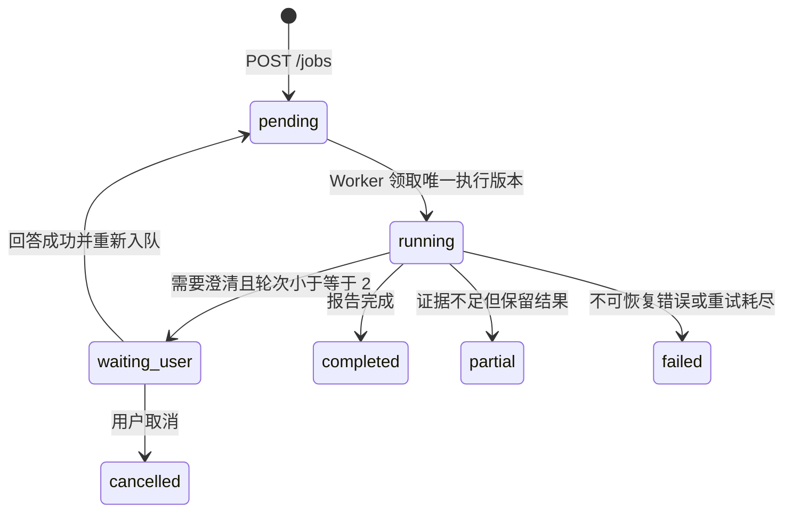

# 交互式竞争情报 vNext

## 产品目标

vNext-A 在现有 Agent MVP 之前增加一个可持久暂停的研究范围澄清闭环：模糊输入不立即进入 Planner、Researcher、MCP、ASR 或搜索；系统先形成一个严格的 `BriefDecision`，必要时把 Job 持久化为 `waiting_user`。用户回答后恢复同一个 Job，最多澄清两轮，形成 `TopicSpec` 后再执行现有 LangGraph。

这不是继续调 P0-C。P0-A 带保留通过、P0-B 工程 Gate 通过、P0-C 质量 Gate 失败并冻结、P0-D/P0-E 未开始。vNext 不修改 P0-C 的账号资格、评分、权重、排序、Provider、私有证据、Bundle 或归档分支。

## P0 与 vNext 边界

| 范围 | vNext-A |
|---|---|
| 模糊需求的结构化澄清 | 已实现后端底座 |
| PostgreSQL 持久暂停/恢复 | 已实现 |
| TopicSpec 传入现有分析图 | 已实现 |
| P0-C 账号质量调优 | 不做 |
| 候选账号人工确认 | 不做，属于 vNext-C |
| 新竞争情报报告模板 | 不做，沿用现有报告链路 |
| 极简前端回答表单 | 已实现 |
| 复杂对话 UI 或视觉重构 | 不做 |

## TopicSpec Schema

`TopicSpec` 使用 Pydantic 严格校验并拒绝额外字段：

```json
{
  "topic": "相机",
  "target_content": ["相机测评", "摄影器材评测"],
  "include_creator_types": ["reviewer", "educator"],
  "exclude_content": ["旅行日志", "日常生活"],
  "time_window_days": 365,
  "allow_generalist": false,
  "competitor_definition": "持续发布相机相关内容的账号",
  "platform": "bilibili",
  "assumptions": [],
  "confidence": 0.88
}
```

平台只能是 `bilibili`；字符串、数组、时间窗口和置信度均有边界。两轮后仍未确认的范围必须进入 `assumptions`，且保守回退的置信度不会伪装为高置信度。

## BriefDecision

`need_clarification=true` 时必须包含一个问题、2～4 个严格选项并允许自定义回答；不能同时包含 TopicSpec。`need_clarification=false` 时必须包含合法 TopicSpec。模型 JSON、Schema 或 Provider 失败时走保守澄清；第二轮后不再继续追问，而是生成带假设的收窄 TopicSpec。

Brief Validator Prompt 由 `src/prompts/prompts.yaml` 管理，版本为 `brief-validator.vnext.1`。它使用默认 Planner/DeepSeek 路由，不读取 Researcher 的可选微调模型注册，因此不改变项目三模型开关语义。

## 状态机



`waiting_user` 表示 Worker 已正常结束且正在等待用户输入，不是失败，也不触发 Arq 自动 Retry。普通 retry 不接受 `waiting_user`，被取消但仍有待回答问题的 Job 也不能绕过澄清直接重试。

## API 契约、权限与幂等

- `GET /jobs/{job_id}/clarification`：返回当前 pending 问题、最多轮次和历史。
- `POST /jobs/{job_id}/clarification`：支持 `selected_option_id`、`custom_answer` 或二者同时提交。
- 两个接口都要求登录并复用 Job 所有权检查；其他用户统一得到 `JOB_NOT_FOUND`。
- `request_id` 必须属于当前 Job。选项 ID、文本长度和自定义回答权限均严格校验。
- 同一 `request_id` 的完全相同答案重复提交直接返回当前 Job，不再次入队；不同答案返回 HTTP 409。
- 每次首次接受回答都会增加 `execution_version`，唯一 Arq ID 为 `analysis:{job_id}:v{execution_version}`。即使客户端重试或发生队列确认不确定性，同一执行版本也不会生成另一个队列身份。

## 数据库结构

`analysis_jobs` 新增：

- `topic_spec`：可空 JSON。
- `clarification_round`：已生成的澄清轮次。
- `execution_version`：创建、普通 retry 和澄清恢复使用的执行身份；与 `retry_count` 分离。
- `interaction_usage`：Brief Validator 累计 token、估算成本和调用次数。

`job_clarifications` 保存稳定 `request_id`、Job、轮次、问题、选项、是否允许自定义、pending/answered 状态、选择项、补充文本和时间。`(job_id, round)` 与 `request_id` 均唯一；只随所属 Job 级联删除。

## Worker 暂停、恢复与用量累计

功能开启后，Worker 在任何 Planner、Researcher、MCP、ASR 或搜索之前执行 Brief Validator。需要澄清时写入 PostgreSQL、记录 `clarification_needed` 并正常返回；回答接口记录 `clarification_answered`，增加执行版本后重新入队。TopicSpec 就绪后记录 `scope_confirmed`，再调用现有图。

每轮 Brief Validator 的用量先累计到 `analysis_jobs.interaction_usage`。等待用户期间该值不会丢失；最终 `UsageRecord` 将互动用量与后续 LangGraph/ASR 用量合并，因此不会只记录最后一次恢复后的调用。

## 为什么不依赖 MemorySaver 持久恢复

当前 LangGraph Checkpointer 是 Worker 进程内 `MemorySaver`。Worker 重启、换进程或重新部署后，该内存状态可能消失。vNext-A 因此使用 PostgreSQL 业务状态机保存问题、回答、轮次、TopicSpec、执行版本和累计用量；LangGraph 只在 TopicSpec 就绪后开始。执行版本也进入 LangGraph `thread_id`，用于隔离不同执行尝试，但这不等于 LangGraph 原生 interrupt/resume。

## 功能开关与回退

`ENABLE_INTERACTIVE_BRIEF=false` 为默认值，App 与 Worker 在 Compose 中接收同一配置。关闭时，`POST /jobs` 仍立即入队，Worker 直接进入原有 LangGraph，不调用 Brief Validator，也不改变 Planner、Researcher、Analyst、Writer 或 Researcher 微调模型路由。

## 已完成与未完成

vNext-A 已完成严格契约、独立 migration、PostgreSQL 暂停/恢复、所有权与幂等 API、唯一执行版本、累计用量、Worker 前置门禁、`waiting_user` 极简回答表单和自动化测试。

尚未完成：真实收费 canary、复杂对话体验、候选账号确认、候选质量验证、新报告模板、生产部署和 LangGraph 原生 interrupt/resume。面试材料、简历、八股文和产品化路线图留到 vNext-E 最终 Gate 后统一同步。

## 后续阶段

- vNext-B：澄清历史、编辑与更完整的错误恢复体验。
- vNext-C：候选账号人工确认闭环。
- vNext-D：竞争情报报告交互与证据体验。
- vNext-E：端到端 Gate、真实边界验证和面试材料统一同步。
