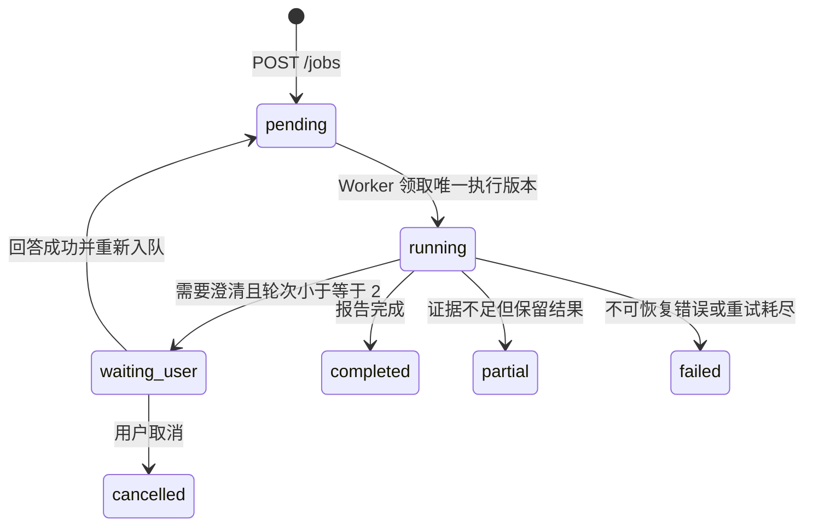

# 交互式竞争情报 vNext

## 产品目标

vNext-A 在现有 Agent MVP 之前增加一个可持久暂停的研究范围澄清闭环：模糊输入不立即进入 Planner、Researcher、MCP、ASR 或搜索；系统先形成一个严格的 `BriefDecision`，必要时把 Job 持久化为 `waiting_user`。用户回答后恢复同一个 Job，最多澄清两轮，形成 `TopicSpec` 后再执行现有 LangGraph。

这不是继续调 P0-C。P0-A 带保留通过、P0-B 工程 Gate 通过、P0-C 质量 Gate 失败并冻结、P0-D/P0-E 未开始。vNext 不修改 P0-C 的账号资格、评分、权重、排序、Provider、私有证据、Bundle 或归档分支。

## P0 与 vNext 边界

| 范围 | vNext-A |
|---|---|
| 模糊需求的结构化澄清 | 已实现后端底座 |
| PostgreSQL 持久暂停/恢复 | 已实现 |
| TopicSpec 传入现有分析图 | 已实现 |
| P0-C 账号质量调优 | 不做 |
| 候选账号人工确认 | 不做，属于 vNext-C |
| 新竞争情报报告模板 | 不做，沿用现有报告链路 |
| 极简前端回答表单 | 已实现 |
| 复杂对话 UI 或视觉重构 | 不做 |

## TopicSpec Schema

`TopicSpec` 使用 Pydantic 严格校验并拒绝额外字段：

```json
{
  "topic": "相机",
  "target_content": ["相机测评", "摄影器材评测"],
  "include_creator_types": ["reviewer", "educator"],
  "exclude_content": ["旅行日志", "日常生活"],
  "time_window_days": 365,
  "allow_generalist": false,
  "competitor_definition": "持续发布相机相关内容的账号",
  "platform": "bilibili",
  "assumptions": [],
  "confidence": 0.88
}
```

平台只能是 `bilibili`；字符串、数组、时间窗口和置信度均有边界。两轮后仍未确认的范围必须进入 `assumptions`，且保守回退的置信度不会伪装为高置信度。

## BriefDecision

`need_clarification=true` 时必须包含一个问题、2～4 个严格选项并允许自定义回答；不能同时包含 TopicSpec。`need_clarification=false` 时必须包含合法 TopicSpec。模型 JSON、Schema 或 Provider 失败时走保守澄清。最多两轮由 Service 单点控制：初次判断可生成 round 1，第一次回答后仍不明确可生成 round 2；第二次回答后直接生成带假设、低置信度的收窄 TopicSpec，不再发起第 3 次 LLM 请求。

Brief Validator Prompt 由 `src/prompts/prompts.yaml` 管理，版本为 `brief-validator.vnext.1`。它使用默认 Planner/DeepSeek 路由，不读取 Researcher 的可选微调模型注册，因此不改变项目三模型开关语义。

## 状态机



`waiting_user` 表示 Worker 已正常结束且正在等待用户输入，不是失败，也不触发 Arq 自动 Retry。普通 retry 不接受 `waiting_user`，被取消但仍有待回答问题的 Job 也不能绕过澄清直接重试。

澄清回答与普通 retry 都先在数据库事务中锁定并校验 Job，再提交回答、`pending`、新 `execution_version` 和事件；只有提交成功后才调用 Redis/Arq enqueue。队列失败时用新事务把同一执行版本从 `pending` 转为 `failed / WORKER_FAILED` 并记录失败事件，不会静默留下没有队列任务的 `pending`。已回答的 clarification 保持 `answered`，随后可通过普通 retry 生成新执行版本恢复。

## API 契约、权限与幂等

- `GET /jobs/{job_id}/clarification`：返回当前 pending 问题、最多轮次和历史。
- `POST /jobs/{job_id}/clarification`：支持 `selected_option_id`、`custom_answer` 或二者同时提交。
- 两个接口都要求登录并复用 Job 所有权检查；其他用户统一得到 `JOB_NOT_FOUND`。
- `request_id` 必须属于当前 Job。选项 ID、文本长度和自定义回答权限均严格校验。
- 同一 `request_id` 的完全相同答案重复提交直接返回当前 Job，不再次入队；不同答案返回 HTTP 409。
- 每次首次接受回答都会增加 `execution_version`，唯一 Arq ID 为 `analysis:{job_id}:v{execution_version}`。即使客户端重试或发生队列确认不确定性，同一执行版本也不会生成另一个队列身份。
- `retry_count` 只记录重试次数，`execution_version` 只标识执行尝试；两者继续分离。

## 数据库结构

`analysis_jobs` 新增：

- `topic_spec`：可空 JSON。
- `clarification_round`：已生成的澄清轮次。
- `execution_version`：创建、普通 retry 和澄清恢复使用的执行身份；与 `retry_count` 分离。
- `interaction_usage`：Brief Validator 累计 token、估算成本和调用次数。

`job_clarifications` 保存稳定 `request_id`、Job、轮次、问题、选项、是否允许自定义、pending/answered 状态、选择项、补充文本和时间。`(job_id, round)` 与 `request_id` 均唯一；只随所属 Job 级联删除。

## Worker 暂停、恢复与用量累计

功能开启后，Worker 在任何 Planner、Researcher、MCP、ASR 或搜索之前执行 Brief Validator。需要澄清时写入 PostgreSQL、记录 `clarification_needed` 并正常返回；回答接口记录 `clarification_answered`，增加执行版本后重新入队。TopicSpec 就绪后记录 `scope_confirmed`，再调用现有图。

Brief Validator 的外部 LLM await 不长期持有或信任旧 ORM Job。LLM 返回后，Service 使用新会话锁定并重查 Job；只有状态仍为当前执行版本的 `running` 才能写入 clarification 或 TopicSpec。期间发生取消时保持 `cancelled`，旧执行版本也不能覆盖新版本；已产生的 Validator token 和估算费用仍会累计。Worker 在进入图前再次检查状态与执行版本，图执行轮询也会在取消或版本变化时停止旧任务。

每轮 Brief Validator 的用量先累计到 `analysis_jobs.interaction_usage`。等待用户期间该值不会丢失；最终 `UsageRecord` 将互动用量与后续 LangGraph/ASR 用量合并，因此不会只记录最后一次恢复后的调用。

## 为什么不依赖 MemorySaver 持久恢复

当前 LangGraph Checkpointer 是 Worker 进程内 `MemorySaver`。Worker 重启、换进程或重新部署后，该内存状态可能消失。vNext-A 因此使用 PostgreSQL 业务状态机保存问题、回答、轮次、TopicSpec、执行版本和累计用量；LangGraph 只在 TopicSpec 就绪后开始。执行版本也进入 LangGraph `thread_id`，用于隔离不同执行尝试，但这不等于 LangGraph 原生 interrupt/resume。

## 功能开关与回退

`ENABLE_INTERACTIVE_BRIEF=false` 为默认值，App 与 Worker 在 Compose 中接收同一配置。关闭时，`POST /jobs` 仍立即入队，Worker 直接进入原有 LangGraph，不调用 Brief Validator，也不改变 Planner、Researcher、Analyst、Writer 或 Researcher 微调模型路由。

## vNext-B 冻结设计

### 澄清历史

`GET /jobs/{job_id}/clarification` 继续复用 Job 所有权检查，但把当前 `pending` 问题与已回答历史分开返回。`current` 只表示当前仍可回答的问题；`history` 只包含按 round 升序排列的已回答记录，并包含所选选项、自定义补充和回答时间。接口与页面都不暴露内部 Prompt、模型原始响应或执行密钥。

### 范围修订：创建新 Job

vNext-B 不允许原地改写已经回答的 clarification、TopicSpec 或报告。`POST /jobs/{job_id}/revisions` 根据旧 Job 创建新的分析 Job，并通过 `revision_of_job_id` 建立可追溯链；旧、新 Job 分别记录审计事件。新 Job 从 round 0、execution version 0 开始，继承平台与分析模式，但使用用户提交的新研究范围。

- `pending`、`running` 不能修订，必须先完成或取消，避免绕过当前执行版本。
- `waiting_user` 修订会在同一数据库事务中明确取消旧 Job，再创建新 Job；旧问题和已有回答仍保留。
- `failed`、`cancelled`、`completed`、`partial` 只能作为不可变来源创建新 Job。已有报告和用量不会被清除或覆盖。
- 重复提交使用新的幂等键返回同一个修订 Job；同一幂等键若指向其他任务或不同修订内容则返回冲突。

没有选择“重置同一 Job 的 clarification round、删除旧回答再重跑”，因为这会混淆审计、执行版本和报告归属。也没有在 vNext-B 引入可编辑 TopicSpec：当前最小方案让每次范围变化都对应一个独立、可回滚和可比较的 Job。

### 派发 reconciliation

vNext-B 使用最小 PostgreSQL reconciliation，而不是完整 transactional outbox。每次创建、回答、retry 或范围修订在提交 `pending` 与新执行版本时，同时写入 `dispatch_pending_at` 并清空 `arq_job_id`。enqueue 成功后保存确定性 Arq ID 并清除该时间；API 已确认的 enqueue 失败仍转为 `failed / WORKER_FAILED`。

Worker 每分钟执行一次有限批量扫描，只租约超过安全阈值的 `status=pending AND arq_job_id IS NULL AND dispatch_pending_at IS NOT NULL` 记录。租约会把时间推进到当前时刻，避免多 Worker 高频重复；恢复始终复用原 `execution_version` 和 `analysis:{job_id}:v{execution_version}`，不增加 `retry_count`。成功、失败和开始尝试都有审计事件；失败保留 pending 并给出可取消后恢复的明确提示，下一次尝试仍需重新等待安全阈值。

完整 outbox 没有被采用，因为当前系统只有一种确定性 Arq 派发消息，PostgreSQL 状态已经包含全部重建参数；增加 outbox 表、发布器和消息生命周期会扩大 migration 与运维面。reconciliation 能直接覆盖 commit 后进程退出，以及 Redis 已接收但数据库未保存 Arq ID 两种窗口，同时保持重复调用幂等。

### vNext-B 合同与配置

- Migration `20260723_0003_interactive_vnext_b.py` 增加 `revision_of_job_id`、`dispatch_pending_at`、外键和派发扫描索引。
- API 增加 `POST /jobs/{job_id}/revisions`；澄清读取继续使用原路径，但明确返回 `current` 与 `history`。
- `JobRead.can_retry` 由服务端统一计算：仅 `failed`、`cancelled`、`partial` 且不存在 pending clarification 时为 true；retry 接口复用同一规则。
- `JobRead.can_revise` 表示 Job 状态可作为修订来源：`waiting_user`、`failed`、`cancelled`、`completed`、`partial` 为 true；用量和 ASR 能力仍由提交接口最终校验。
- 两个能力都是响应层计算值，不新增数据库布尔列。前端只依据能力显示操作；后端仍是并发和状态变化的最终防线。
- 审计事件增加 `scope_revision_created`、`scope_revision_started`、`dispatch_recovery_started`、`dispatch_recovered`、`dispatch_recovery_failed`。
- `DISPATCH_RECONCILE_MIN_AGE_SECONDS` 默认 60 秒，`DISPATCH_RECONCILE_BATCH_SIZE` 默认 50；Worker 每分钟扫描一次，不忙等待。

## 已完成与未完成

vNext-A 已完成严格契约、PostgreSQL 暂停/恢复、执行版本和默认关闭兼容链路。vNext-B 已完成澄清历史、创建新 Job 的范围修订、审计关系、派发 reconciliation、错误提示和极简前端入口；当前只到 Gate 候选，等待总控复核。

PostgreSQL 业务状态机仍不等于 LangGraph 原生 interrupt/resume。本阶段没有真实收费 canary，没有证明候选账号选择质量提升；P0-C 继续失败冻结。复杂对话体验、候选账号确认、候选质量验证、新报告模板和生产部署仍未完成。

## 后续阶段

- vNext-B：当前 Gate 候选，等待总控复核。
- vNext-C：候选账号人工确认闭环，尚未开始。
- vNext-D：竞争情报报告交互与证据体验。
- vNext-E：端到端 Gate、真实边界验证和面试材料统一同步。
