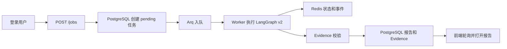

# B站单平台产品 MVP 架构

## 页面信息架构

- 公共：首页、注册、登录、示例报告、公开分享报告
- 登录后：Dashboard、新建分析、任务进度、报告详情、历史任务、设置与用量
- 旧 `/report/{id}` 保留兼容跳转，正式报告路径为 `/reports/{id}`

## 任务流

第一版进度读取采用可靠轮询。Worker 同时把短期状态写入 Redis Hash/Stream，后续可以在不改变任务模型的前提下增加跨 Worker SSE。

## 状态与恢复

- `pending`：已持久化并等待 Worker
- `running`：Worker 已领取
- `completed`：报告和引用校验通过
- `partial`：保留可用结果，并明确证据不足
- `failed`：保存产品错误码与可读说明
- `cancelled`：用户取消，Worker 轮询数据库后中止图任务

Worker 使用有限重试、指数退避、总超时与 Provider 并发信号量。API 幂等键在 `(user_id, idempotency_key)` 上唯一。

## 数据职责

| 组件 | 职责 |
|---|---|
| PostgreSQL | 用户、任务、报告、Evidence、反馈、用量、分享链接 |
| Redis | Arq 队列、临时状态、事件、锁、转写缓存 |
| ChromaDB | 知识库向量 |
| LangGraph Checkpointer | 当前仍为进程内短期图状态；业务恢复以任务与报告表为准 |

## ASR 深度分析

标准分析不调用 ASR。内容深度分析在能力可用时，从本次真实样本中选择最多 5 个公开 B 站视频，Worker 下载临时音频、压缩为 64kbps MP3、调用 MiMo ASR，再重新运行 Analyst 与 Writer。全部转写失败时降级为元数据分析并记录 warning 事件。
